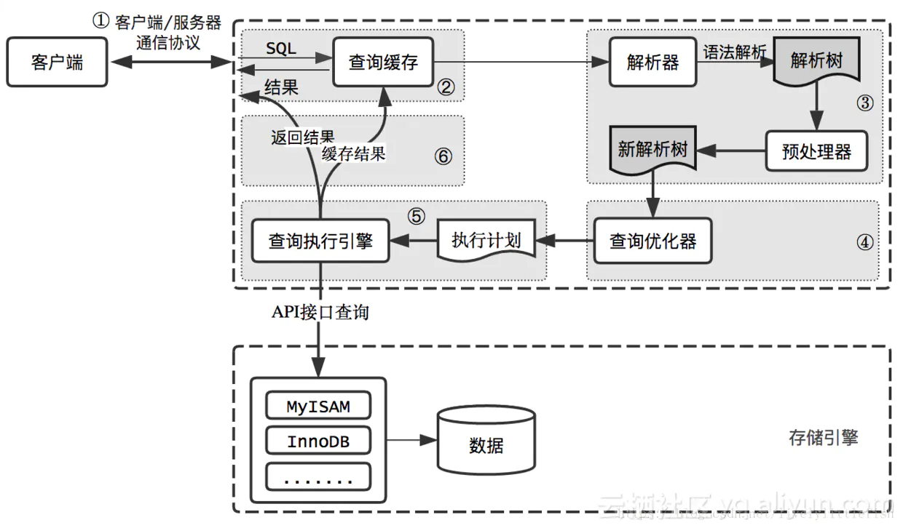
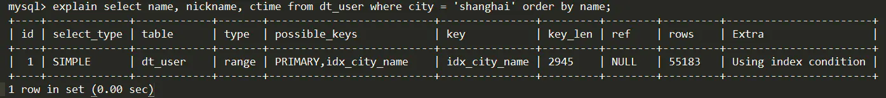

# MySQL执行计划
在实际数据库项目开发中，由于我们不知道实际查询时数据库里发生了什么，也不知道数据库是如何扫描表、如何使用索引的，因此，我们能感知到的就只有SQL语句的执行时间。尤其在数据规模比较大的场景下，如何写查询、优化查询、如何使用索引就显得很重要了。

那么，问题来了，在查询前有没有可能估计下查询要扫描多少行、使用哪些索引呢？

答案是肯定的。以MySQL为例，MySQL通过explain命令输出执行计划，对要执行的查询进行分析。

什么是执行计划呢？

简单来说，就是SQL在数据库中执行时的表现情况，通常用于SQL性能分析、优化等场景。

## MySQL查询过程

MySQL查询过程如下：

1.客户端将查询发送到MySQL服务器；

2.服务器先检查查询缓存，如果命中，立即返回缓存中的结果；否则进入下一阶段；

3.服务器对SQL进行解析、预处理，再由优化器生成对象的执行计划；

4.MySQL根据优化器生成的执行计划，调用存储引擎API来执行查询；

5.服务器将结果返回给客户端，同时缓存查询结果；

## 执行计划
MySQL会解析查询，并创建内部数据结构（解析树），并对其进行各种优化，包括重写查询、决定表的读取顺序、选择合适的索引等。

用户可通过关键字提示（hint）优化器，从而影响优化器的决策过程。也可以通过通过优化器解释（explain）优化过程的各个因素，使用户知道数据库是如何进行优化决策的，并提供一个参考基准，便于用户重构查询和数据库表的schema、修改数据库配置等，使查询尽可能高效。

这个执行计划给出的信息是，该查询通过一个简单的给定范围的扫描，共扫描55183行，使用index condition条件在dt_user表中筛选出，扫描过程中使用PRIMARY和idx_city_name索引。

type：表的连接类型，其值、性能由高到底排列如下：
- system，表中只有一行记录，相当于系统表；
- const，通过索引一次命中，匹配一行数据；
- eq_ref，唯一性索引扫描，对于每个索引键，表中只有一条记录与之匹配，常用于主键或唯一索引扫描；
- ref，非唯一性索引扫描，返回匹配某个单独值的所有行，用于=、<或>操作符带索引的列；
- range，只检索给定范围的行，使用一个索引来选择行，一般用于between、<、>；
- index，只遍历索引树；
- all，全表扫描；

**_前5种情况都是理想的索引的情况。通常优化至少到range级别，最好能优化到ref。_**

possible_keys：可能使用的索引。如果该值为 NULL，说明没有使用索引，可以建立索引提高性能；

key：显示 MySQL 实际使用的索引。如果为 NULL，则没有使用索引查询；

key_len : MySQL中使用索引字节长度

【引用】

MySQL执行计划解析

https://www.jianshu.com/p/119832887221

explain输出参数

https://dev.mysql.com/doc/refman/5.7/en/explain-output.html