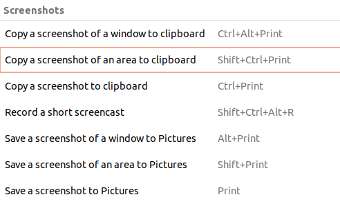

目录
# Linux大全
---
## 防火墙
在Ubuntu中，您可以使用ufw（Uncomplicated Firewall）来管理防火墙。以下是启用和配置基本防火墙的步骤：

首先，确保ufw已经安装。如果没有安装，可以使用以下命令安装：
```bash
sudo apt-sudo apt-get install ufw
```
启用ufw：
```bash
sudo ufw enable
```
（可选）允许特定端口（例如，如果您运行Web服务器，需要允许端口80和443）：
```bash
sudo ufw allow 80
sudo ufw allow 443
```
（可选）你也可以指定协议：
```bash
sudo ufw allow 22/tcp
```
您可以列出所有规则并检查状态：
```bash
sudo ufw status verbose
```
如果需要，您可以禁用ufw：
```bash
sudo ufw disable
# 或者
sudo systemctl stop ufw.service
sudo systemctl disable ufw.service
```

## 强制关机引起磁盘只读问题
强制关机有概率会让挂载的磁盘变成只读文件系统

**修复步骤如下**
1. 打开ubuntu中自带的“磁盘”程序（你可通过搜索程序“磁盘”来找到，也可通过菜单栏找到，还可以终端运行：`gnome-disks`）
2. 找到并单击选中想要修复的磁盘，然后点击左下方齿轮状的按钮，并单击运行`check filesystem`和`Repair filesystem`命令（一般只需要`Repair filesystem`命令）
3. 出现提示单击“确定”继续，完成修复。

## 屏幕截图


主要用`Shift+PrtSc`进行屏幕部分截图

