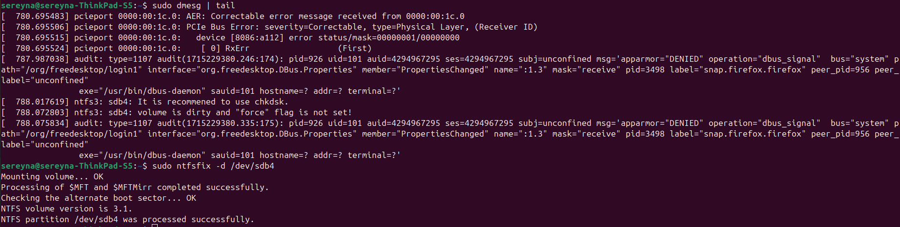

目录
# Linux大全

## 1. 常用命令
### 1.1 dpkg安装
```bash
sudo dpkg -i 安装包.deb
```
**缺少依赖**

如果安装过程中缺少依赖，且下载源无法定位依赖，例如：
```bash
$ sudo apt-get install libgconf-2-4

Reading package lists... Done
Building dependency tree... Done
Reading state information... Done
E: Unable to locate package libgconf-2-4
```

可以下载libgconf-2-4安装包，地址为：http://archive.ubuntu.com/ubuntu/pool/universe/g/gconf/libgconf-2-4_3.2.6-8ubuntu1_amd64.deb
```bash
sudo dpkg -i libgconf-2-4_3.2.6-8ubuntu1_amd64.deb
```

如果报错，未安装软件包 gconf2-common，下载gconf2-common安装包，地址为：http://archive.ubuntu.com/ubuntu/pool/universe/g/gconf/gconf2-common_3.2.6-8ubuntu1_all.deb
```bash
sudo dpkg -i gconf2-common_3.2.6-8ubuntu1_all.deb
```

==安装包查询地址==
https://pkgs.org/download/libgconf-2-4 

**卸载安装包**
首先，你需要找出由特定包依赖或依赖的所有包。你可以使用`apt-cache`命令来查找这些信息。例如，如果你想要卸载包`package`，你可以运行以下命令：
```bash
apt-cache rdepends package
```

要删除包及其依赖，你可以使用`apt-get`命令。你需要添加`--auto-remove`和`--purge`选项以确保移除依赖和数据文件。
```bash
sudo apt-get remove --purge package --auto-remove
```

### 1.2 屏幕截图

ubuntu24.04
主要用`PrtSc`进行屏幕部分截图


## 2. 磁盘问题
### 2.1 强制关机引起磁盘只读问题
强制关机有概率会让挂载的磁盘变成只读文件系统

**修复步骤如下**
1. 打开ubuntu中自带的“磁盘”程序（你可通过搜索程序“磁盘”来找到，也可通过菜单栏找到，还可以终端运行：`gnome-disks`）
2. 找到并单击选中想要修复的磁盘，然后点击左下方齿轮状的按钮，并单击运行`check filesystem`和`Repair filesystem`命令（一般只需要`Repair filesystem`命令）
3. 出现提示单击“确定”继续，完成修复。

### 2.2 解决wrong fs type, bad option, bad superblock on /dev/sda1问题
挂载磁盘出现以下错误：


**解决办法**

出现这种问题应该先尝试从日志入手，输入：
```bash
sudo dmesg | tail
```


搜索发现这是因为 `/dev/sdb4` 这个volume被标记为`dirty`，并且`ntfs3`在没有`force`这个flag设置的情况下不会挂载。

这种情况可以通过`ntfsfix`命令去修复，查看`man ntfsfix`可以看到有一个-d参数，可以清除这个dirty的标记。
```bash
sudo ntfsfix -d /dev/sdb4
```
提示成功（如上图），重新挂载就没有出现这个问题了。

## 防火墙
在Ubuntu中，您可以使用ufw（Uncomplicated Firewall）来管理防火墙。以下是启用和配置基本防火墙的步骤：

首先，确保ufw已经安装。如果没有安装，可以使用以下命令安装：
```bash
sudo apt-sudo apt-get install ufw
```
启用ufw：
```bash
sudo ufw enable
```
（可选）允许特定端口（例如，如果您运行Web服务器，需要允许端口80和443）：
```bash
sudo ufw allow 80
sudo ufw allow 443
```
（可选）你也可以指定协议：
```bash
sudo ufw allow 22/tcp
```
您可以列出所有规则并检查状态：
```bash
sudo ufw status verbose
```
如果需要，您可以禁用ufw：
```bash
sudo ufw disable
# 或者
sudo systemctl stop ufw.service
sudo systemctl disable ufw.service
```


## 修改ubuntu源镜像
以增加系统更新的速度

在`/etc/apt/sources.list`中注释掉原有的源，添加新的源镜像地址。例如，使用阿里云的镜像站点：
```bash
deb http://mirrors.aliyun.com/ubuntu/ jammy main restricted universe multiverse
deb-src http://mirrors.aliyun.com/ubuntu/ jammy main restricted universe multiverse
 
deb http://mirrors.aliyun.com/ubuntu/ jammy-updates main restricted universe multiverse
deb-src http://mirrors.aliyun.com/ubuntu/ jammy-updates main restricted universe multiverse
 
deb http://mirrors.aliyun.com/ubuntu/ jammy-backports main restricted universe multiverse
deb-src http://mirrors.aliyun.com/ubuntu/ jammy-backports main restricted universe multiverse
 
deb http://mirrors.aliyun.com/ubuntu/ jammy-security main restricted universe multiverse
deb-src http://mirrors.aliyun.com/ubuntu/ jammy-security main restricted universe multiverse
```
其中`jammy`是Ubuntu22.04的版本号，可根据需要替换

**更新软件源：**
```bash
sudo apt-get update
```
这一步如果报错，根据错误提示，报错原因是缺少公钥`E88979FB9B30ACF2`，公钥在错误提示里
```bash
W: An error occurred during the signature verification. The repository is not updated and the previous index files will be used. GPG error: http://dl.google.com/linux/chrome/deb stable InRelease: The following signatures couldn't be verified because the public key is not available: NO_PUBKEY E88979FB9B30ACF2
W: Failed to fetch http://dl.google.com/linux/chrome/deb/dists/stable/InRelease  The following signatures couldn't be verified because the public key is not available: NO_PUBKEY E88979FB9B30ACF2
W: Some index files failed to download. They have been ignored, or old ones used instead.
```

添加公钥
```bash
$ sudo apt-key adv --keyserver keyserver.ubuntu.com --recv-keys E88979FB9B30ACF2

Executing: /tmp/apt-key-gpghome.VggvMw29Et/gpg.1.sh --keyserver keyserver.ubuntu.com --recv-keys E88979FB9B30ACF2
gpg: key 7721F63BD38B4796: 2 duplicate signatures removed
gpg: key 7721F63BD38B4796: "Google Inc. (Linux Packages Signing Authority) <linux-packages-keymaster@google.com>" 3 new signatures
gpg: key 7721F63BD38B4796: "Google Inc. (Linux Packages Signing Authority) <linux-packages-keymaster@google.com>" 2 new subkeys
gpg: Total number processed: 1
gpg:            new subkeys: 2
gpg:         new signatures: 3

# 这个输出表示已经成功从keyserver.ubuntu.com服务器上获取了公钥
# 现在再尝试运行sudo apt-get update应该就可以成功索引了
```

**升级已安装的包：**
```bash
sudo apt-get -y upgrade
```

## Chrome不能安装crx文件的问题
在命令行里输入
```bash
~$ /opt/google/chrome/google-chrome --enable-easy-off-store-extension-install
```