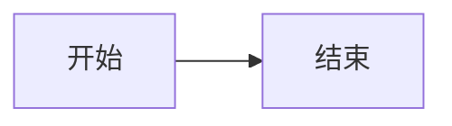
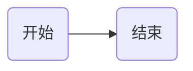

# Markdown语法
---
## 1. 引用
### 1.1 引用图片
```markdown

```
第一个`mysql-查询过程`是链接的名字，第二个`mysql-查询过程`是给外部读者看的，鼠标悬停在图片上就会显示文字。

### 1.2 引用任何链接
```
[IMG](IMG/sogou.png "搜狗")
```
效果：[IMG](IMG/sogou.png "搜狗")
```
[text](README.md "读我")
```
效果：[text](README.md "读我")

## 2. 流程图
Markdown的原生语法不支持绘制图形，但通过`Mermaid`扩展，我们可以将一些格式化的文字渲染成我们需要的图形。常用的图形有 “流程图”、“时序图”、“类图”、“状态图”、“甘特图”、“饼图” 等。


- 流程图：指定 mermaid（样式流程图） 或 flow （标准流程图）解析语言
- 时序图：指定 sequence（标准时序图） 或 mermaid（样式时序图） 解析语言
- 甘特图：指定 mermaid 解析语言

### 2.1 基本语法
基本的流程图包含：流程图布局方向、几何图形和连接线三个部分组成。以下是一个简单的Markdown流程图示例，采用Mermaid语法：
```

```
效果：


**说明**
- `graph LR;`指定这是一个有向图
- 节点以及节点之间的关系通过`-->`来表示。
- 方框中的文字表示节点的名称，例如`A[开始]`表示开始节点。
- `决策`节点后接两条分支线，分别表示决策的两个选项。
- 流程图的开始和结束通过特殊节点`开始`和`结束`表示。

**流程方向**

| 符号/术语     | 含义     | 
| -------- | -------- | 
| TB/TD | 从上到下（Top to Bottom）的流程方向 | 
| BT | 从下到上（Bottom to Top）的流程方向 | 
| LR | 从左到右（Left to Right）的流程方向 | 
| RL | 从右到左（Right to Left）的流程方向 | 
| HZ | 水平方向（Horizontal）的流程方向 | 
| VT | 垂直方向（Vertical）的流程方向 | 

**节点定义**
| 表述     | 说明     | 
| -------- | -------- |
| id[文字] | 矩形节点 |
| id(文字) | 圆形矩形节点 |
| id((文字)) | 圆形节点 |
| id>文字] | 右向旗帜状节点 |
| id{文字} | 菱形节点 |
| `id[[文字]]` | 双边框 |
| id[(文字)] | 圆柱 |
| id{{文字}} | 两边尖尖 |

### 2.2 连接线的种类

### 2.3 节点形状

### 2.4 其他

## 3. 绘制表格
```markdown
| 表头     | 表头     | 表头     |
| -------- | -------- | -------- |
| 行1，列1 | 行1，列2 | 行1，列3 |
| 行2，列1 | 行2，列2 | 行2，列3 |
| 行3，列1 | 行3，列2 | 行3，列3 |
```
效果：
| 表头     | 表头     | 表头     |
| -------- | -------- | -------- |
| 行1，列1 | 行1，列2 | 行1，列3 |
| 行2，列1 | 行2，列2 | 行2，列3 |
| 行3，列1 | 行3，列2 | 行3，列3 |

---
【引用】

Markdown流程图绘制详解 https://blog.csdn.net/u014696856/article/details/135616695
markdown的mermaid用法及例子 https://blog.csdn.net/m0_63456808/article/details/138942065