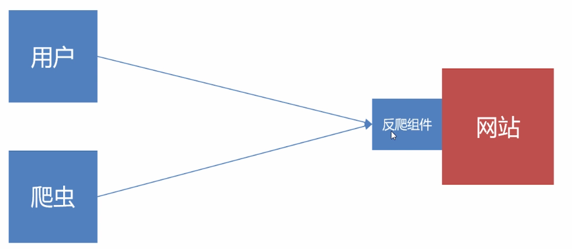
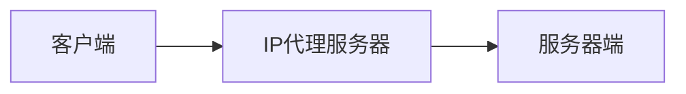

# 反爬技术
**反爬的目的**
1. 初级爬虫——简单粗暴，不管服务器压力，容易弄挂网站
2. 数据保护
3. 失控的爬虫——由于某些原因，忘记或者无法关闭的爬虫

**反爬组件**

关键在于准确识别爬虫，并且不能误伤用户，最直白的方式就是弹出一些框以确认你不是爬虫

## 1. 常见的反爬策略
### 1.1 user-agent反爬
在Nginx.conf中配置反爬：
```conf
server{
    # 禁止Scrapy等工具抓取
    if($http_user_agent ~* (Scrapy|Curl|HttpClient|python)){
        return 403;
    }

    # 禁止非`GET|HEAD|POST`方式的抓取
    if($request_method !~ ^(GET|HEAD|POST)$){
        return 403;
    }
}

```

**==反反爬策略==**
安装fake-useragent
```bash
$ pip install fake-useragent
```

使用
```python
from fake_useragent import UserAgent

ua = UserAgent()
print(ua.random)

headers = {
    "User-Agent": ua.random
}
```

### 1.2 IP访问频率限制
频率设置非常灵活，如可设置同一个IP一分钟访问多少次、一个小时访问多少次、一天访问多少次，访问的间隔是不是有规律等等

Nginx具有统计同一个IP在一定时间内的访问频率的功能

**==反反爬策略==**
1. 摸清频率设置，不按照它的识别规律来
2. IP代理池

**==IP代理==**


免费的代理IP用的人太多，容易被封
收费的代理IP：阿布云

什么情况下代理不可行：需要登录才能访问的网站

### 1.3 必须登录（账号访问频率）
大型网站比较常见，可以同时通过IP和账号进行限制，反爬高效

**==反反爬策略==**
1. 多账号管理

### 1.4 动态网页——加大分析难度

### 1.5 前端JS逻辑加密和混淆

### 1.6 机器学习分析爬虫行为
例如：只请求HTML，不请求JS和CSS；CSS代码下毒，在代码中隐藏一个链接，但浏览器不显示，凡是访问这个链接的统统识别为爬虫

以上情况较少

## 2. 签名技术
随着Internet的不断发展，网络安全问题日益突出。为了确保接收方所接收到的报文数据的完整性，人们采用消息认证来验证上述性质。用来对消息进行认证的主要方式有以下3种：消息认证码、散列函数和消息加密。
1. 消息认证码：它是一个需要密钥的算法，可以对可变长度的消息进行认证，把输出的结果作为认证符。
2. 散列函数：它是将任意长度的消息映射成为定长的散列值的函数，以该散列值消息摘要作为认证符。
3. 消息加密：它将整个消息的密文作为认证符。

>HMAC是一种利用密码学中的散列函数来进行消息认证的一种机制，所能提供的消息认证包括两方面内容：
①消息完整性认证：能够证明消息内容在传送过程没有被修改。
②信源身份认证：因为通信双方共享了认证的密钥，接收方能够认证发送该数据的信源与所宣称的一致，即能够可靠地确认接收的消息与发送的一致。

**网站如何反爬**
以CSDN为例：信源身份认证
1. 元数据x-ca-key、x-ca-nonce（随机生成）
2. 网页前端利用key和nonce，根据HMAC算法计算出签名x-ca-signature
3. 将x-ca-key、x-ca-nonce、x-ca-signature发送至服务器端，服务器利用key和nonce，根据HMAC算法计算出签名x-ca-signature'，再比对x-ca-signature、x-ca-signature'是否相等，相等则对接成功。

---
# 反反爬技术

## 1. 代理IP
阿布云