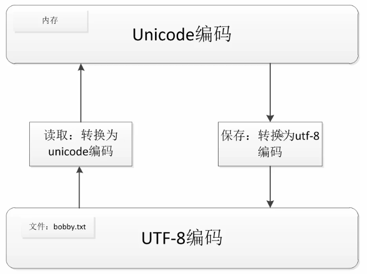

# 爬虫基础
---
**爬虫能做什么**
1. 搜索引擎——百度、Google、垂直领域搜索引擎
2. 推荐头条——今日头条
3. 机器学习的数据样本
4. 数据分析（如金融数据分析）、舆情分析等

## 1. 基本思想
**需要询问**
1. 要爬哪些数据？
2. 爬取策略是什么？


## 2. 高并发
### 2.1 多线程
### 2.2 异步io（asyncio）
https://blog.csdn.net/m0_68949064/article/details/132805165

## 3. 爬虫去重

1. 将访问过的URL保存到数据库当中（不怎么使用，查询频繁）
2. 将访问过的URL保存到set当中，只需要O(1)的代价就可以查询URL（缺点：内存占用会越来越大）
3. URL经过MD5哈希后保存到set当中
4. 用bitmap方法，将访问过的URL通过hash函数映射到某一位（缺点：冲突非常高）

5. bloomfilter方法对bitmap进行改进，多重哈希函数降低冲突

## 4. 字符串编码


### 4.1 编码转换
encode表示的是编码，decode表示的是解码。

**decode**
decode 参数中的格式便是字符串现在的格式，解码后会使得字符串变成Unicode格式
```py
str = "这是中文"  # 假设这是utf-8格式
str.decode('utf8')  # 字符串会变成Unicode格式
```

**encode**
在python中encode之前一定要保证字符串是Unicode格式，如果不是，就先解码，再编码。
比如：
```py
str = "这是中文"  # 假设这是utf-8格式
str.encode('utf8')  # 会出错，因为在解码之前字符串不是Unicode格式
str.decode('utf8').encode('utf8')  # 这才是正确做法
```
在python3中定义的字符串默认都是Unicode格式，所以不需要解码过程，可以直接进行编码