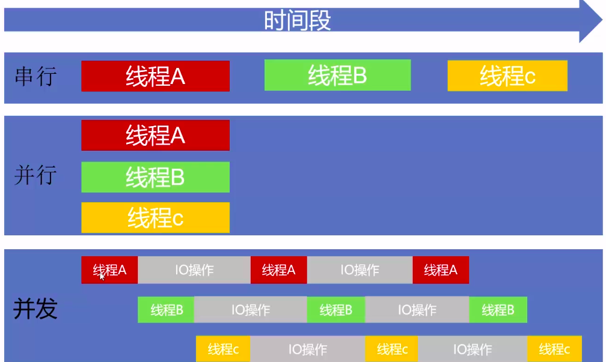
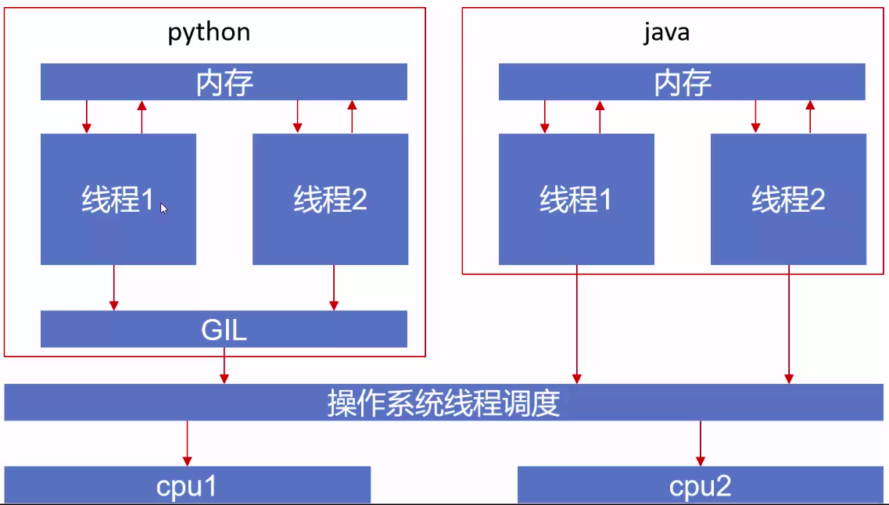

# 多线程（multithreading）
---
## 1. 概念
### 1.1 并发和并行

**并发**
1. 并发是指两个或多个事件在==同一时间段==发生
2. 并发主要针对一个CPU而言
3. 并发的目的是充分利用CPU的每一个核，以达到最高的处理性能

**并行**
1. 并行是指两个或多个事件在==同一时刻==发生
2. 并行指的是多个CPU



==IO操作的时间是远远大于线程在CPU中运算的时间的==


## 2. 并发


## 3. 并行

## 4. GIL
**什么是GIL**

GIL的全称是Global Interpreter Lock(全局解释器锁),来源是python设计之初的考虑，为了数据安全所做的决定。每个CPU在同一时间只能执行一个线程(在单核CPU下的多线程其实都只是并发，不是并行)

某个线程想要执行，必须先拿到GIL,我们可以把GIL看作是“通行证”,并且==在一个python进程==中，GIL只有一个。拿不到通行证的线程，就不允许进
入CPU执行，GIL会释放的：
1. 时间片释放-指定时间释放
2. 遇到io释放

==也就是说，GIL无法利用多CPU的特性==

流程如下：也就是说，每一个时刻，每个Python进程通过GIL提交给操作系统调度的线程只有一个，那么就无法充分利用多个CPU


**解决方法**
1. 如果是以IO时间为主的应用程序，比如web开发，那么GIL的时间可以忽略不计。
2. 如果是以CPU处理时间为主的程序，比如计算类的程序，那么可以使用Python多进程来解决。

**可以更换解释器吗？**

Python的解释器有cpython（GIL就是它的产物）、jython、pypy
不建议更换，因为有大量的库依赖cpython，而GIL虽然有局限性，但仍保证了程序安全：
1. GIL会保证字节码的安全

## 5. 线程同步（Lock）
代码演示
```python
from threading import Lock

total = 0
total_lock = Lock()  # 新建一把锁

def add():
    total_lock.acquire()  # 等待获取锁
    global total
    for i in range(1000000):
        total += 1
    total_lock.release()  # 中间程序全部运行完成后释放（把锁交出去）

def desc():
    total_lock.acquire()  # 等待获取锁
    global total
    for i in range(1000000):
        total -= 1
    total_lock.release()  # 中间程序全部运行完成后释放（把锁交出去）

if __name__ == "__main__":
    # add和desc两个方法用的是同一把锁，一个用锁另一个就会挂起
    add_thread = Thread(target=add)
    desc_thread = Thread(target=desc)

    add_thread.start()
    desc_thread.start()

    add_thread.join()  # 阻塞，等待程序完成
    desc_thread.join()  # 阻塞，等待程序完成
    print(total)
    # 如果不用锁的话，根据GIL的时间片概念，每次运行的结果都会不一样
```

## 6. 线程间通信
线程间通信的两种办法：
1. 最基本：可运用全局变量，比如数组，一边append，一边pop
2. 消息队列Queue