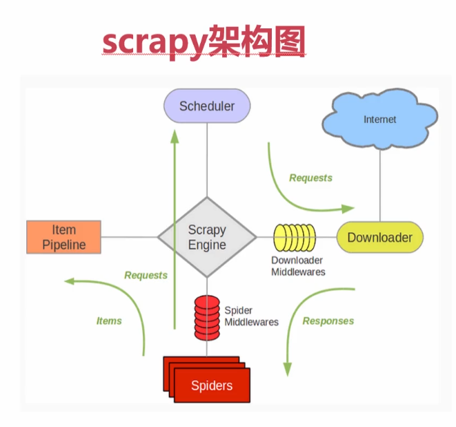
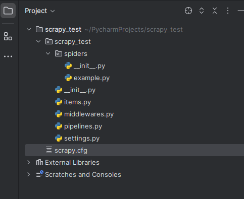

# Scrapy
---

## 0. Scrapy架构原理

**架构原理**
1. 引擎——`Scrapy Engine`
3. 爬虫——`Spiders`包含所有爬虫的爬取逻辑，主要是解析`url`
4. 中间件——`Spider Middlewares`和`Downloader Middlewares`，本质是一层一层的处理器
5. 模型和管道——`Item`负责定义数据，`Pipeline`负责处理数据
6. 调度器——`Schedule`调度所有`Requests`请求，对程序员黑盒
6. 下载器——`Downloader`下载`url`，返回一个`Responses`，对程序员黑盒

## 1. 快速上手
制作 Scrapy 爬虫 一共需要4步:
1. 新建项目 (scrapy startproject xxx)：新建一个新的爬虫项目
2. 明确目标 （编写items.py）：明确你想要抓取的目标
3. 制作爬虫 （spiders/xxspider.py）：制作爬虫开始爬取网页
4. 存储内容 （pipelines.py）：设计管道存储爬取内容

### 1.1 新建项目
在开始爬取之前，必须创建一个新的Scrapy项目。进入自定义的python虚拟环境中，运行下列命令：
```bash
# 进入虚拟环境
sereyna@sereyna-ThinkPad-S5:~/Environment/venv$ source ./bin/activate
# 进入自定义目录里执行`scrapy startproject`命令
(venv) sereyna@sereyna-ThinkPad-S5:~/PycharmProjects$ scrapy startproject scrapy_test

New Scrapy project 'scrapy_test', using template directory '/home/sereyna/Environment/venv/lib/python3.12/site-packages/scrapy/templates/project', created in:
    /home/sereyna/PycharmProjects/scrapy_test

You can start your first spider with:
    cd scrapy_test
    scrapy genspider example example.com
```
命令`scrapy genspider spidername example.com`意在生成爬虫
```bash
(venv) sereyna@sereyna-ThinkPad-S5:~/PycharmProjects/scrapy_test$ scrapy genspider example example.com
Created spider 'example' using template 'basic' in module:
  scrapy_test.spiders.example
```
该命令将会在目录`spiders`下生成`example.py`文件

**Scrapy项目结构**


scrapyproject.png

## 2. Scrapy命令

### 2.1 创建
**创建项目**
```bash
scrapy startproject scrapy_test
```
该命令将会在执行命令本目录下生成项目`scrapy_test`

**创建爬虫**
```bash
scrapy genspider example example.com
```
该命令将会在项目目录`scrapy_test/spiders`下生成`example.py`文件

### 2.2 执行
**执行指定爬虫**
```bash
scrapy crawl csdn
```
该命令将会执行目录`scrapy_test/spiders`下的爬虫`csdn`
