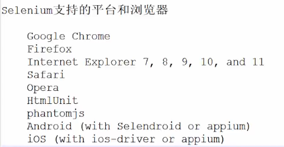

# Selenium
---
>selenium是一个用于Web应用程序测试的工具
selenium可以直接操作浏览器，就像真正的用户一样
selenium支持多种编程语言（JAVA\python\js\c#\ruby），进行测试脚本的编写
selenium支持在多个浏览器平台上执行测试
selenium是一个工具集，有了这个工具集，就可以顺利开展自动化测试



**直接安装**
```py
pip install selenium
```


## 1. driver下载
**原始方法**

chrome：https://googlechromelabs.github.io/chrome-for-testing/#stable

下载的driver一定要对应chrome版本

**开始引用**
```py
from selenium import webdriver

browser = webdriver.Chrome('/home/sereyna/Environment/chromedriver-linux64/chromedriver')
```

### 1.1 undetected-chromedriver
因为selenium控制浏览器会被一些网站识别出来，所以还要下载`undetected-chromedriver`，其为开源项目
```py
pip install undetected-chromedriver
```
==缺点：非常慢，谷歌被墙，如果要用的话需要多尝试几次==

**使用说明**
可参考官方文档

```py
import undetected_chromedriver as uc
driver = uc.Chrome(headless=True,use_subprocess=False)
driver.get('https://nowsecure.nl')
driver.save_screenshot('nowsecure.png')
```


## 2. 具体使用

**无界面启动Selenium**

需要优化的两个问题：
1. 无界面启动Selenium
2. 不加载图片，只需要图片URL即可

==进阶加速==：
1. scrapy-splash提高并发性
2. 分布式selenium+grid提高并发性能

### 2.1 iframe
`iframe`比较特殊，需要主动进入：
```py
browser.switch_to.frame(browser.find_element_by_tag_name("iframe"))
```

---
# 【引用】
- undetected-chromedriver文档 https://github.com/ultrafunkamsterdam/undetected-chromedriver