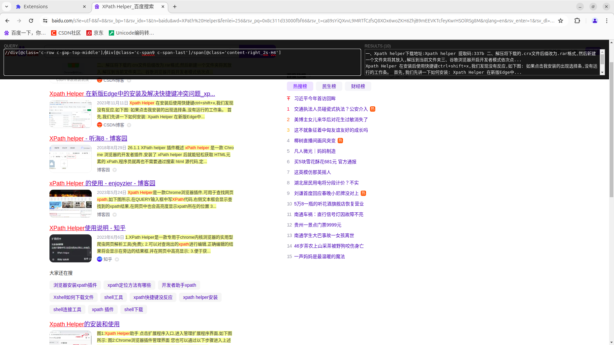
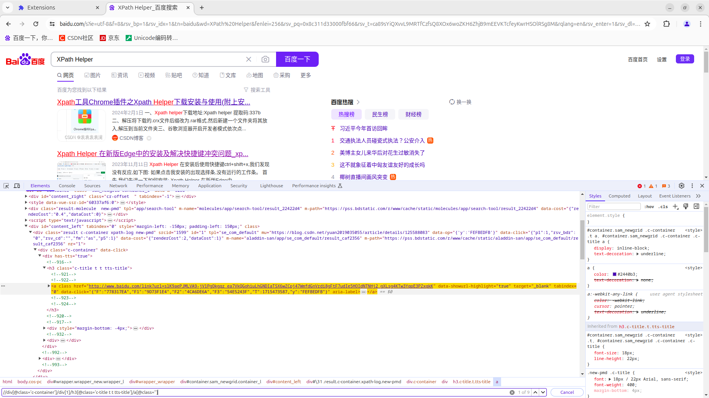
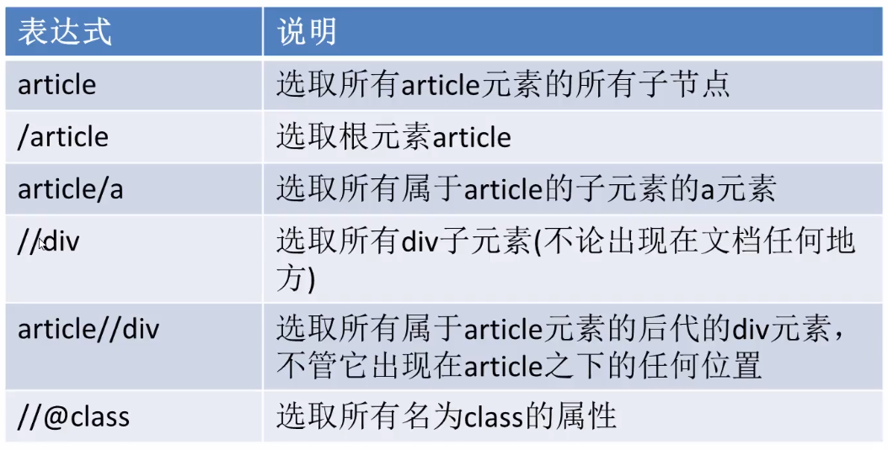
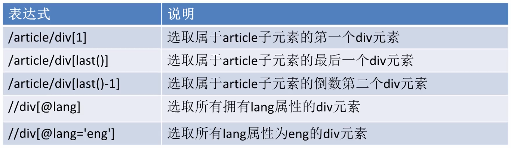
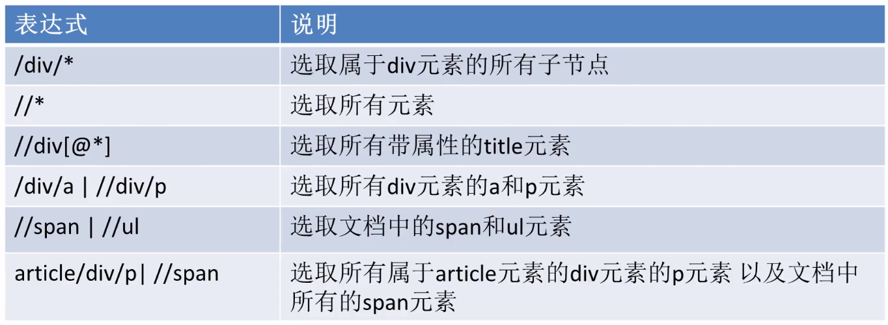

# Xpath
---
>XPath 是一门在 XML 文档中查找信息的语言。XPath 可用来在 XML 文档中对元素和属性进行遍历。
XPath 使用路径表达式来选取 XML 文档中的节点或者节点集。这些路径表达式和我们在常规的电脑文件系统中看到的表达式非常相似。
在编写爬虫程序的过程中提取信息是非常重要的环节，但是有时使用正则表达式无法匹配到想要的信息，或者书写起来非常麻烦，此时就需要用另外一种数据解析方法，也就是 Xpath 表达式。

提示：XML 是一种遵守 W3C 标椎的标记语言，类似于 HTML，但两者的设计目的是不同，XML 通常被用来传输和存储数据，而 HTML 常用来显示数据。

## 1. Xpath节点
在 XPath 中，有七种类型的节点：**元素**、**属性**、**文本**、命名空间、处理指令、**注释**以及**文档节点**（或称为根节点）。

例如：
```xml
<?xml version="1.0" encoding="ISO-8859-1"?>

<bookstore>（文档节点，甭管叫啥名）

  <book>
    <title lang="en"（属性节点）>Harry Potter</title>
    <author>J K. Rowling</author> （元素节点）
    <year>2005</year>
    <price>29.99</price>
  </book>

</bookstore>
```

**节点关系**

父节点、子节点、同胞、先辈节点、后代节点这五种关系

## 2. Xpath语法
XPath 使用路径表达式来选取 XML 文档中的节点或节点集。节点是通过沿着路径 (path) 或者步 (steps) 来选取的。

### 2.1 路径表达式
| 表达式     | 描述     | 
| -------- | -------- | 
| node_name | 选取此节点的所有子节点。 |
| / | 绝对路径匹配，从根节点选取。 |
| // | 相对路径匹配，从所有节点中查找当前选择的节点，包括子节点和后代节点，其第一个 / 表示根节点。 |
| . | 选取当前节点。 |
| .. | 选取当前节点的父节点。 |
| @ | 选取属性值，通过属性值选取数据。常用元素属性有 `@id` `@name` `@type` `@class` `@tittle` `@href`。 |

注意：当需要查找某个特定的节点或者选取节点中包含的指定值时需要使用`[]`方括号。如下所示：
```
xpath表达式：//ul/li[@class="book2"]/p[@class="price"]
```

**通配符**
| 通配符     | 描述说明 | 
| -------- | -------- | 
| * | 匹配任意元素节点 |
| @* | 匹配任意属性节点 |
| node() | 匹配任意类型的节点 |

**多路径匹配**
多个 Xpath 路径表达式可以同时使用，其语法如下： 
```
xpath表达式1 | xpath表达式2 | xpath表达式3
```

### 2.2 常用内建函数
Xpath 提供 100 多个内建函数，这些函数给我们提供了很多便利，比如实现文本匹配、模糊匹配、以及位置匹配等，下面介绍几个常用的内建函数。

| 函数名称     | xpath表达式示例     | 示例说明     |
| -------- | -------- | -------- |
| text() | `./text()` | 文本匹配，表示值取当前节点中的文本内容。 |
| contains() | `//div[contains(@id,'stu')]`  | 模糊匹配，表示选择 id 中包含“stu”的所有 div 节点。 |
| last() | `//*[@class='web'][last()]` | 位置匹配，表示选择`@class='web'`的最后一个节点。 |
|  position() | `//*[@class='site'][position()<=2]` | 位置匹配，表示选择`@class='site'`的前两个节点。 |
| start-with() | `//input[start-with(@id,'st')]` | 匹配 id 以 st 开头的元素。 |
| ends-with() | `//input[ends-with(@id,'st')]` | 匹配 id 以 st 结尾的元素。 |
| concat(string1,string2) | `concat('C语言中文网',.//*[@class='stie']/@href) 	` | C语言中文与标签类别属性为"stie"的 href 地址做拼接。 |


## 3. Xpath Helper
`Xpath Helper` 是一款谷歌应用商店推出的免费工具，下载完毕后，谷歌浏览器会将其作为插件自动安装在扩展程序中。

安装完毕后，在需要匹配数据的页面处，使用快捷键打开助手工具（快捷键：ctrl+shift+x）

将鼠标悬停在需要选取数据的文本上，并按下`shift`按键就会自动出现 Xpath 表达式，然后再根据自己的需求对表达式稍微修改即可。



谷歌开发者调试工具也内置了 Xpath 表达式匹配功能，首先打开调试工具，在下方的调试工作区内使用快捷键ctrl+F打开 Xpath 匹配功能，==只能正向匹配==，如下图所示：



下载链接：

>云盘链接：https://pan.baidu.com/s/18LcxOCLqALlob33UybTATA
提取码：eo1m


## 练习案例







---

【引用】
- Xpath W3C文档 https://www.w3school.com.cn/xpath/xpath_syntax.asp
- Xpath简明教程 https://c.biancheng.net/python_spider/xpath.html
- Xpath Helper的安装和使用 https://c.biancheng.net/python_spider/xpath-helper.html