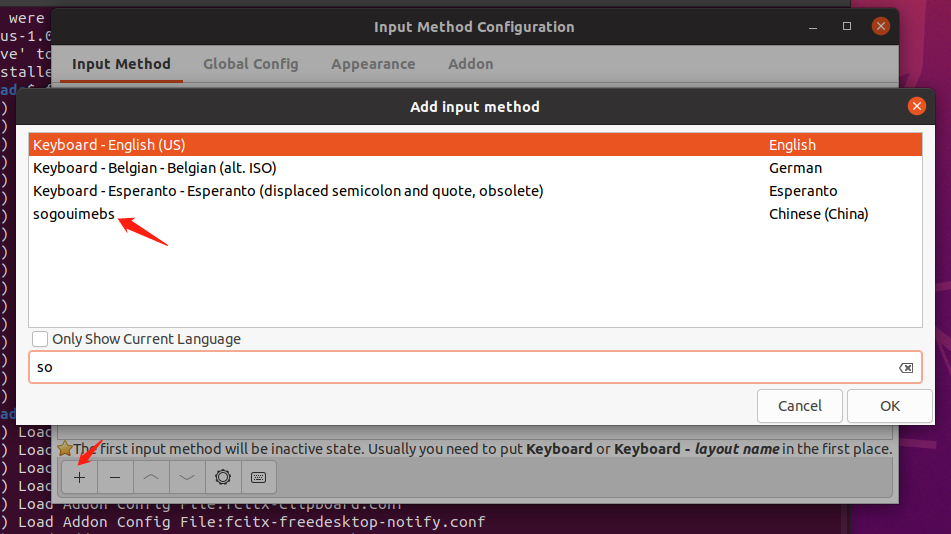

# ubuntu 24.04LTS 系统初始化配置
---

==不要！不要！不要！在系统的APP商城里下东西！都是阉割过的！==
## 1. 安装软件
### 1.1 安装sogou拼音

去官网下载最新的版本：https://shurufa.sogou.com/

严格参考官网步骤来：https://shurufa.sogou.com/linux/guide

**需要注意！！！！下面这个`Only Show Current Language`默认是勾上的！要把它取消才能搜到`sogoupinyin`**

